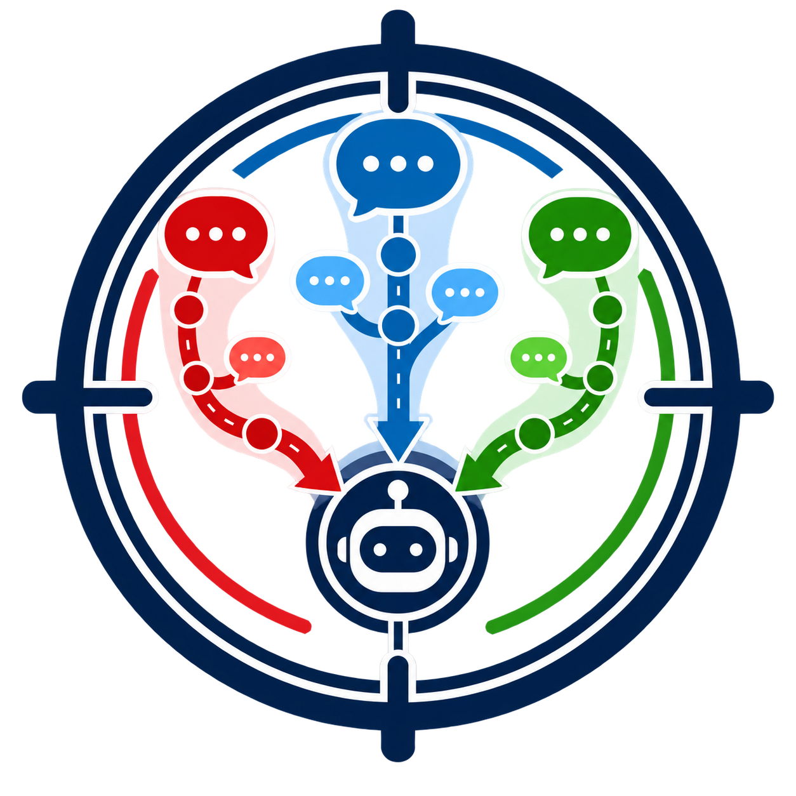
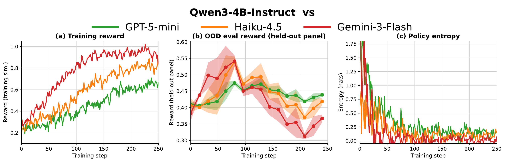
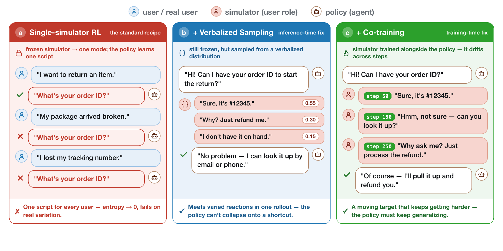
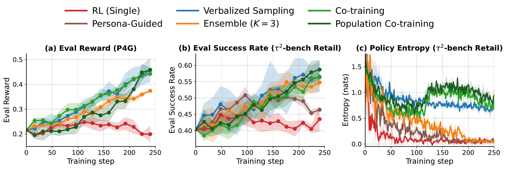

<div align="center">



<h1>SCOPE: One Frozen Simulator Is Not Enough</h1>
<h3>Simulator Collapse in Multi-Agent RL</h3>

[](https://arxiv.org/abs/2608.12253)
[](https://2026.emnlp.org/)
[](https://www.python.org/)
[](LICENSE)

Simon Yu · Nicholas Tomlin · Marwa Abdulhai · Ximing Lu · Derek Chong · Abe Hou · Dilara Soylu · Sergey Levine · Christopher D. Manning · Weiyan Shi

</div>

---

> [!IMPORTANT]
> **This is the camera-ready research release.** The training launchers target dedicated Linux GPU nodes and stop existing Ray and SGLang services before startup. Read the [experiment guide](cmd/slime/README.md) before launching a run.

<p align="center">
  <a href="#installation">Install</a> |
  <a href="#quickstart">Quickstart</a> |
  <a href="#two-fixes">Methods</a> |
  <a href="#citation">Citation</a>
</p>

**SCOPE** is an open-source framework for population-based multi-agent reinforcement learning with LLM user simulators. It supports frozen-simulator RL, model rotation, Verbalized Sampling, self-play, dual-model Co-Training, and Population Co-Training through one rollout interface.

Training against one frozen simulator creates a systematic failure mode: the policy learns the simulator's dominant script, loses behavioral diversity, and transfers poorly to unseen simulators and real users. SCOPE provides inference-time and training-time fixes for this **simulator collapse**.

## Installation

Clone SCOPE with its pinned benchmark and training dependencies:

```bash
git clone --recurse-submodules https://github.com/CHATS-lab/scope_usim.git
cd scope_usim

python -m venv .venv
source .venv/bin/activate
python -m pip install --upgrade pip
pip install -e ".[slime,tau2,dev]"
pip install -e ./slime
pip install -e ./external/tau2-bench
```

If you cloned without submodules:

```bash
git submodule update --init --recursive
```

For CooperBench, also run `pip install -e ./external/CooperBench`. Full training requires a compatible Linux GPU environment, Megatron-LM, and converted model checkpoints; the [experiment guide](cmd/slime/README.md) documents the complete setup.

## Quickstart

Run the keyless local checks:

```bash
pytest -q
python scripts/diagnostics/simulate_vs_episodes.py --help
```

Then exercise the production Verbalized Sampling prompt, parser, and JSON schema without a GPU:

```bash
export OPENAI_API_KEY="<your OpenAI API key>"

python scripts/diagnostics/simulate_vs_episodes.py \
  --env p4g \
  --num-episodes 3 \
  --num-turns 5 \
  --agent-model gpt-5-mini \
  --agent-api-key-var OPENAI_API_KEY \
  --output results/diagnostics/vs_sim/p4g.jsonl
```

The harness records every sampled candidate set and writes a JSONL episode trace plus a one-page summary. It uses the same SCOPE prompts, structured-output schema, and sampling path as training.

## Simulator collapse

A frozen LLM simulator does not expose the full range of plausible user behavior. Repeated policy updates therefore reward whatever strategy exploits that simulator's mode, even while held-out reward and policy entropy deteriorate.

<p align="center">
  
</p>

The paper formalizes this as a biased policy gradient: when simulator behavior concentrates around one mode, the policy gradient approaches the gradient of a mode-user environment. The policy can remain actively learning while becoming less transferable.

## Two fixes

<p align="center">
  
</p>

- **Verbalized Sampling — inference-time.** At each user turn, the frozen simulator proposes several plausible replies and their likelihoods; SCOPE samples one reply for the rollout.
- **Co-Training — training-time.** The user simulator learns alongside the policy, so the behavioral mode moves across training instead of remaining a fixed target.
- **Population Co-Training.** The active simulator is sampled from a pool of recent checkpoints, exposing the policy to an evolving population rather than only the latest partner.

## Results

Across Persuasion for Good, τ²-bench, and CooperBench, the camera-ready paper reports:

- Verbalized Sampling improves held-out success by up to **9%** over single-simulator RL.
- Co-Training extends the gain to **14%**.
- Both approaches preserve the policy diversity that collapses under single-simulator RL.
- In the human study, both fixes outperform single-simulator RL on real users.

<p align="center">
  
</p>

## How SCOPE fits together

```text
task + environment
        │
        ▼
┌──────────────────┐     shared conversation     ┌──────────────────┐
│  trainable agent │ ◄─────────────────────────► │  user simulator  │
└────────┬─────────┘                              └────────┬─────────┘
         │ policy reward                                  │ simulator reward
         ▼                                                ▼
   agent optimizer                               frozen / rotating / trainable
```

The environment protocol is independent of the training backend. Slime adapters convert each completed trajectory into role-specific tokens, masks, rollout log-probabilities, and rewards. In dual-model training, the agent and simulator receive separate optimizer updates from their respective turns.

## Repository layout

```text
scope_usim/
├── usim/                    # environments, orchestration, rewards, adapters
├── cmd/slime/               # training and evaluation launchers
├── configs/                 # multi-model SGLang server layouts
├── eval_configs/            # held-out simulator panels
├── data/                    # released P4G and CooperBench task splits
├── scripts/diagnostics/     # lightweight rollout diagnostics
├── human_study/             # study app, deployment, and protocol
├── tests/                   # unit and integration tests
├── patches/                 # pinned Slime compatibility patches
└── external/                # registered benchmark submodules
```

The public Python distribution remains named `usim`, so existing imports and training entry points continue to work.

## Development

Install the development extra and run every dependency-available test:

```bash
pip install -e ".[dev]"
pytest -q
```

Validate every shipped shell launcher and Python module without starting training:

```bash
git ls-files -z '*.sh' | xargs -0 -n1 bash -n
python -m compileall -q usim scripts human_study/backend human_study/scripts tests
```

Optional integration tests skip when the relevant Slime, τ²-bench, or CooperBench dependency is unavailable. The human-study application has its own [`human_study/README.md`](human_study/README.md).

## Citation

If SCOPE is useful in your work, please cite:

```bibtex
@misc{yu2026onefrozen,
  title         = {One Frozen Simulator Is Not Enough: Simulator Collapse in Multi-Agent RL},
  author        = {Yu, Simon and Tomlin, Nicholas and Abdulhai, Marwa and Lu, Ximing and
                   Chong, Derek and Hou, Abe and Soylu, Dilara and Levine, Sergey and
                   Manning, Christopher D. and Shi, Weiyan},
  year          = {2026},
  eprint        = {2608.12253},
  archivePrefix = {arXiv},
  primaryClass  = {cs.CL},
  note          = {Accepted to EMNLP 2026 Main},
  url           = {https://arxiv.org/abs/2608.12253}
}
```

## Acknowledgements

SCOPE builds on [Slime](https://github.com/THUDM/slime), [τ²-bench](https://github.com/sierra-research/tau2-bench), [CooperBench](https://github.com/CooperBench/CooperBench), and the [Tinker cookbook](https://github.com/thinking-machines-lab/tinker-cookbook).

## License

Released under the [Apache License 2.0](LICENSE).
