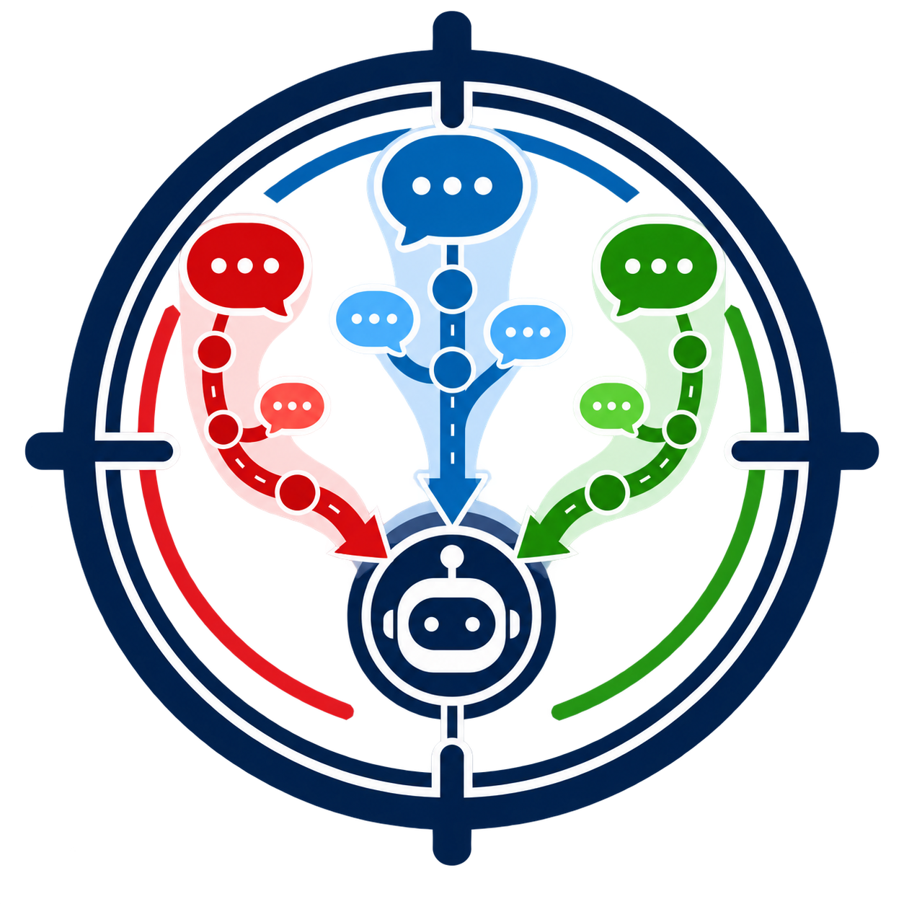
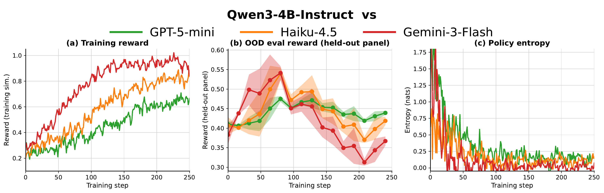
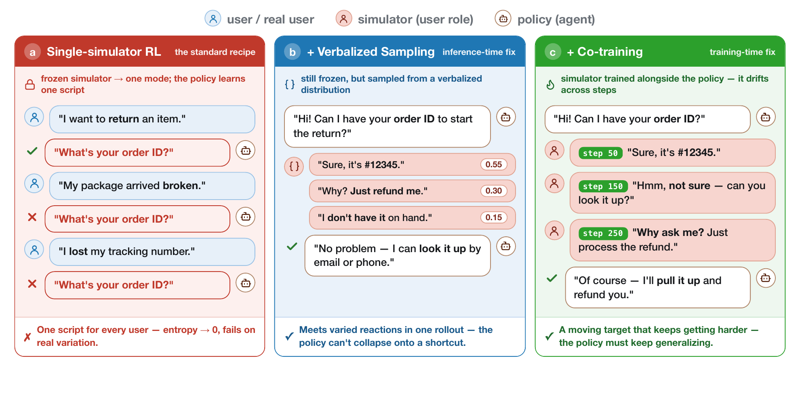
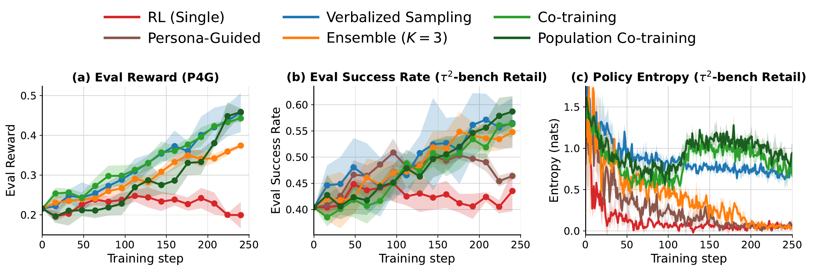

<div align="center">



<h1>SCOPE: One Frozen Simulator Is Not Enough</h1>
<h3>Simulator Collapse in Multi-Agent RL</h3>

[](https://arxiv.org/abs/2608.12253)
[](https://2026.emnlp.org/)
[](https://www.python.org/)
[](LICENSE)

Simon Yu · Nicholas Tomlin · Marwa Abdulhai · Ximing Lu · Derek Chong · Abe Hou · Dilara Soylu · Sergey Levine · Christopher D. Manning · Weiyan Shi

</div>

---

> [!IMPORTANT]
> **This is the camera-ready research release.** Each training launcher expects a dedicated 8-GPU Linux node and kills any running Ray and SGLang processes before it starts (set `SKIP_PROCESS_CLEANUP=1` to skip that step). Read the [experiment guide](cmd/slime/README.md) before launching a run.

<p align="center">
  <a href="#installation">Install</a> |
  <a href="#quickstart">Quickstart</a> |
  <a href="#methods">Methods</a> |
  <a href="#citation">Citation</a>
</p>

**SCOPE** is the code for training LLM agents with reinforcement learning against LLM user simulators. One rollout interface covers four ways to supply the simulator: a single frozen API model, a rotation over several frozen models, a frozen model queried with Verbalized Sampling, and a second trainable model (Co-Training), which can also be drawn from a pool of its own saved checkpoints (Population Co-Training). The dialogue environments are Persuasion for Good (P4G) and τ²-bench. CooperBench runs with a frozen API partner.

An agent trained against one frozen simulator learns that simulator's dominant script. Its training reward keeps rising while its reward against unseen simulators falls and its policy entropy drops. The paper calls this **simulator collapse** and studies one inference-time fix and one training-time fix.

## Installation

Clone the repository with its pinned submodules:

```bash
git clone --recurse-submodules https://github.com/CHATS-lab/scope_usim.git
cd scope_usim

python -m venv .venv
source .venv/bin/activate
python -m pip install --upgrade pip
pip install -e ".[slime,p4g,tau2,dev]"
pip install -e ./slime
pip install -e ./external/tau2-bench
```

If you cloned without submodules:

```bash
git submodule update --init --recursive
```

For CooperBench, also run `pip install -e ".[cooperbench]" -e ./external/CooperBench`. The `diagnostics` extra adds the embedding and clustering packages used by `scripts/diagnostics/measure_coverage.py`. Full training needs a Linux GPU machine, Megatron-LM, and converted model checkpoints; the [experiment guide](cmd/slime/README.md) walks through the setup.

## Quickstart

The unit tests need no GPU and no API keys:

```bash
pytest -q
python scripts/diagnostics/simulate_vs_episodes.py --help
```

With an OpenAI key you can run a few Verbalized Sampling dialogues on a laptop:

```bash
export OPENAI_API_KEY="<your OpenAI API key>"

python scripts/diagnostics/simulate_vs_episodes.py \
  --env p4g \
  --num-episodes 3 \
  --num-turns 5 \
  --agent-model gpt-5-mini \
  --agent-api-key-var OPENAI_API_KEY \
  --output results/diagnostics/vs_sim/p4g.jsonl
```

The harness writes one JSONL record per episode, including every candidate set the simulator proposed and the reply that was sampled, and prints a short summary. It imports the prompts, JSON schema, and candidate sampler that training uses.

## Simulator collapse

A frozen LLM simulator covers a narrow slice of plausible user behavior. Repeated policy updates reward whatever strategy exploits that simulator's most likely replies, and held-out reward and policy entropy decline while training reward climbs.

<p align="center">
  
</p>

The paper formalizes this as a biased policy gradient. When the simulator's behavior concentrates on one mode, the policy gradient approaches the gradient for a user who always gives the modal reply. The policy keeps learning, and what it learns transfers less and less.

## Methods

<p align="center">
  
</p>

Verbalized Sampling works at inference time. On every user turn the frozen simulator returns several candidate replies in one JSON response, and the rollout continues with one of them. Three flags control it: `--usim-verbalized-sampling` switches it on, `--usim-vs-num-samples` sets the number of candidates (5 in the released launchers), and `--usim-vs-method` chooses how the reply is drawn. With `prob`, the simulator also states a probability for each candidate and the draw is weighted by those numbers. With `random`, the prompt asks for candidates only and the draw is uniform. The two `vs_gpt5mini.sh` launchers use `random`.

Co-Training works at training time. A second copy of the policy model plays the user and is updated on its own turns of the same conversations, so the behavior the agent could overfit to keeps moving. Population Co-Training keeps a pool of the simulator's saved checkpoints and loads a randomly chosen one before each rollout.

In the code, Co-Training is `train_cotrain_slime.py --training-mode dual_cotrain`, Population Co-Training is `--training-mode dual_selfplay` with the `--pool-*` flags, and the rollout modules are `usim.slime.cotrain_rollout` (P4G) and `usim.slime.tau2_cotrain_rollout` (τ²-bench). Each task sets the simulator's reward. In P4G the persuadee is rewarded for keeping the donation low. In τ²-bench, `--tau2-user-reward-mode curriculum` rewards the simulator when the agent's successes across the 8 rollouts of a task come close to an even split.

On CooperBench, the released code trains a single coding agent in the `baseline`, `solo`, or `coop` setting, and in `coop` the partner is a fixed API model. There is no Verbalized Sampling, Co-Training, or checkpoint-pool mode for CooperBench.

## Results

Across Persuasion for Good, τ²-bench, and CooperBench, the camera-ready paper reports:

- Verbalized Sampling improves held-out success by up to **9%** over single-simulator RL.
- Co-Training extends the gain to **14%**.
- Both approaches preserve the policy diversity that collapses under single-simulator RL.
- In the human study, both fixes outperform single-simulator RL on real users.

<p align="center">
  
</p>

## How SCOPE fits together

```text
task + environment
        │
        ▼
┌──────────────────┐     shared conversation     ┌──────────────────┐
│  trainable agent │ ◄─────────────────────────► │  user simulator  │
└────────┬─────────┘                              └────────┬─────────┘
         │ policy reward                                  │ simulator reward
         ▼                                                ▼
   agent optimizer                               frozen / rotating / trainable
```

The environment protocol does not depend on the training backend. The Slime adapters turn each finished trajectory into per-role tokens, loss masks, rollout log-probabilities, and rewards. In Co-Training the agent and the simulator are two Slime training groups on separate halves of one 8-GPU node, and each is updated from its own turns.

## Repository layout

```text
scope_usim/
├── usim/                    # environments, orchestration, rewards, Slime adapters
├── train_*_slime.py         # Slime entry points: tau2, P4G, Co-Training, CooperBench
├── cmd/slime/               # one launcher per paper experiment
├── configs/sglang/          # SGLang server layouts for Co-Training
├── eval_configs/            # held-out simulator panels
├── data/                    # P4G corpus and split, CooperBench task splits
├── scripts/                 # diagnostics and a CooperBench sandbox check
├── human_study/             # study app, deployment, and survey files
├── tests/                   # unit tests
├── patches/                 # Slime patch needed for Co-Training
├── slime/                   # Slime submodule
└── external/                # tau2-bench and CooperBench submodules
```

The Python distribution is still named `usim`, so imports and entry points keep their names. [`data/README.md`](data/README.md) describes the data files and their licenses.

## Development

Install the development extra and run the tests:

```bash
pip install -e ".[dev]"
pytest -q
```

Check every shell launcher and Python module without starting training:

```bash
git ls-files -z '*.sh' | xargs -0 -n1 bash -n
python -m compileall -q usim scripts human_study/backend human_study/scripts tests
```

Tests that need Slime, τ²-bench, or CooperBench skip when that package is missing. The human-study app has its own [`human_study/README.md`](human_study/README.md).

## Citation

If SCOPE is useful in your work, please cite:

```bibtex
@misc{yu2026onefrozen,
  title         = {One Frozen Simulator Is Not Enough: Simulator Collapse in Multi-Agent RL},
  author        = {Yu, Simon and Tomlin, Nicholas and Abdulhai, Marwa and Lu, Ximing and
                   Chong, Derek and Hou, Abe and Soylu, Dilara and Levine, Sergey and
                   Manning, Christopher D. and Shi, Weiyan},
  year          = {2026},
  eprint        = {2608.12253},
  archivePrefix = {arXiv},
  primaryClass  = {cs.CL},
  note          = {Accepted to EMNLP 2026 Main},
  url           = {https://arxiv.org/abs/2608.12253}
}
```

## Acknowledgements

SCOPE builds on [Slime](https://github.com/THUDM/slime), [τ²-bench](https://github.com/sierra-research/tau2-bench), and [CooperBench](https://github.com/cooperbench/CooperBench). The `external/CooperBench` submodule points at [simonucl/CooperBench](https://github.com/simonucl/CooperBench), a fork of the upstream repository. The fork makes mini-swe-agent v2 the default agent, fixes Modal sandboxes that exited right after start-up, adds collaboration prompt templates, a single-agent baseline mode with per-episode token and turn counts, cross-model cooperation with per-task timeouts, and Qwen3.5 configurations with thinking mode turned off.

## License

Released under the [Apache License 2.0](LICENSE). [NOTICE](NOTICE) lists the third-party code and data in this repository and their licenses.
